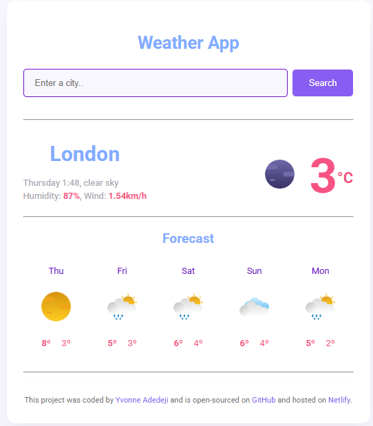

# weather-app-project

## 📌 Description
The Weather App is a web-based application that fetches weather data using an API and presents it in a clean and user-friendly interface. It includes a search functionality where users can input a city name to get real-time weather conditions and a detailed forecast.

## 🛠 Prerequisites
N/A

## 📋 Criteria
* Users can search for a city's weather by entering its name.
* Displays real-time temperature, humidity, and wind speed.
* Shows weather description and an appropriate icon.
* Provides a 5-day weather forecast.
* Responsive design for better user experience across devices.

 ## 💻 Technologies Used
The application is built with the following technologies:
* HTML
* CSS
* JavaScript
* Axios 
* SheCodes Weather API

## 🚀 Installation
No installation is required to use the app. It is hosted online and can be accessed via a web browser.

## 📚 Usage
To use the app:
1. Open the app in your web browser.
2. Enter a city name in the search bar and click Search.
3. View real-time weather details including temperature, humidity, wind speed, and weather description.
4. Scroll down to see a 5-day weather forecast.

## 🔗 Live Demo & Repository
Application can be viewed here: 
* [Live](https://ya-weather-app-project.netlify.app/)

* [Repository](https://github.com/yvonnesarah/weather-app-project)

## 🖼 Screenshot
Below is a preview of Weather App:

## 👥 Credit
N/A

## 📜 License
This project is open-source. For licensing details, please refer to the LICENSE file in the repository.

## 📬 Contact
You can reach me at 📧 yvonneadedeji.sarah@gmail.com.
